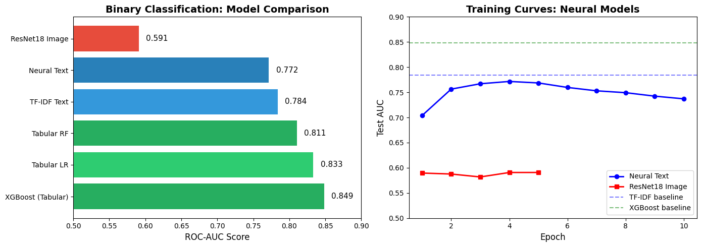
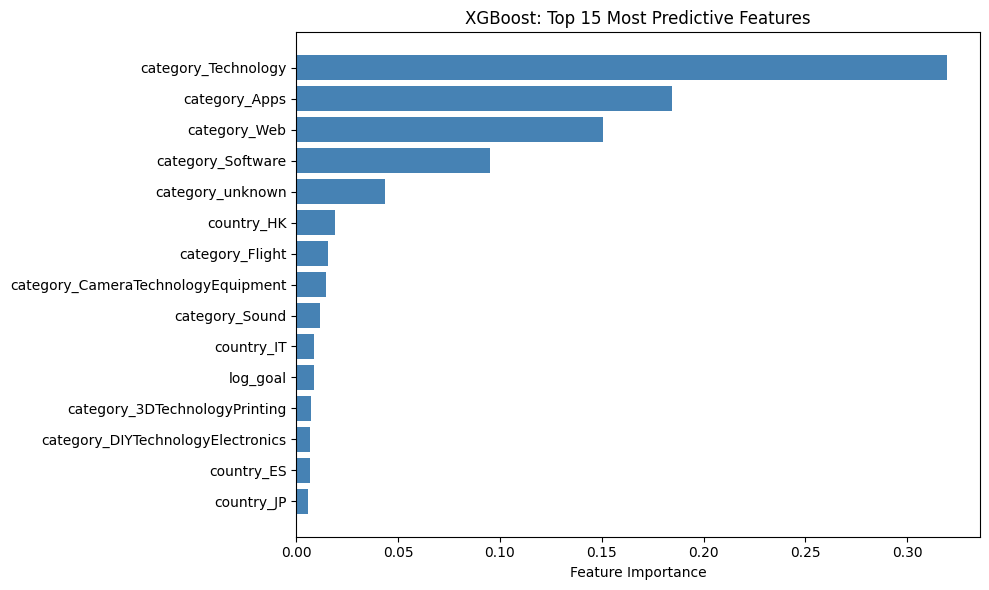
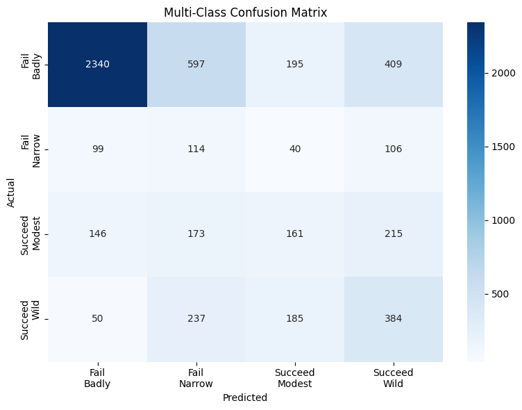
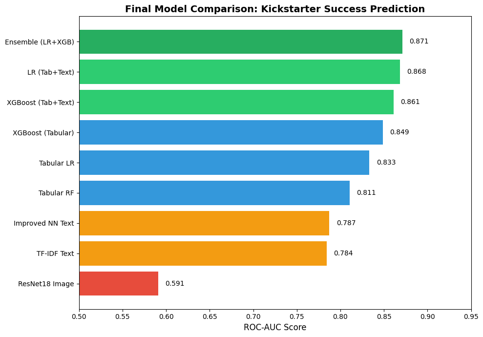
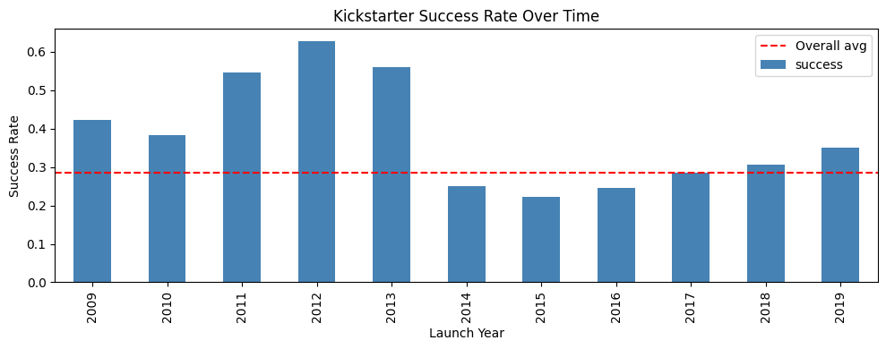
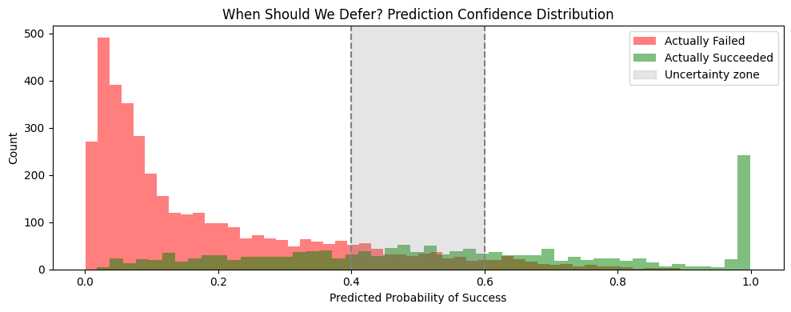

# The Science of Crowdfunding Success
### What 27,251 Kickstarter Campaigns Reveal About Winning vs. Losing

**Authors:** Nathan Spencer, Minuk Choi, Alefia Aziz Ali  
**Course:** MIS382N Machine Learning and Neural Networks – Final Project

---

## The Question

About **40%** of Kickstarter campaigns succeed (~28% in this dataset). Since 2009, more than **$9 billion** has been pledged on the platform, but the gap between winners and everyone else is huge:

(2014-2017)
| Outcome              | Average Raised |
|----------------------|----------------|
| Successful campaigns | $92,758        |
| Failed campaigns     | $2,210         |

What separates a Pebble Watch–style hit from the hundreds of forgotten projects?

> **Can we predict success *before* a campaign launches, using only information available on day one?**

---

## Approach

We analyzed **27,251 Kickstarter campaigns** (2014–2017) using three complementary views of each project:

| Data Type             | What It Contains                                   | Models Used                                      |
|-----------------------|----------------------------------------------------|--------------------------------------------------|
| **Tabular metadata**  | Goal, category, country, duration, pledged, state | Logistic Regression, Random Forest, XGBoost      |
| **Text descriptions** | Short blurbs (one–two sentence pitches)           | TF-IDF + Logistic Regression, Neural Network     |
| **Images**            | Campaign thumbnail images                         | ResNet18 (transfer learning)                     |

We framed two main prediction problems:

1. **Binary classification:** will a campaign **succeed** (reach its goal) or **fail**?
2. **Multi-class classification:** how badly does it fail or how strongly does it succeed?

---

## Key Findings

### 1. Category Dominates (~88% of Predictive Power)

From our best tabular model (XGBoost), feature importance breaks down as:

| Feature Type                 | Importance |
|-----------------------------|------------|
| Category                    | 88%        |
| Country                     | 11%        |
| Numeric (goal, duration)    | 1%         |

> **What you're building matters far more than the exact amount you ask for or the campaign duration.**



---

### 2. Thumbnails Carry Little Extra Signal

We fine-tuned a ResNet18 model on campaign thumbnails and reached an AUC of **0.591** — barely better than random guessing (**0.5**).

> *Under our relatively lightweight ResNet18 setup, we were not able to extract strong predictive signal from thumbnails.*

---

### 3. Words Reveal Intent (and Red Flags)

TF-IDF + Logistic Regression gave us a clean view of which words correlate with success vs failure:

| Predicts Success         | Predicts Failure   |
|--------------------------|--------------------|
| `clock` (+2.57)          | `app` (-4.47)      |
| `arduino` (+2.46)        | `website` (-3.21)  |
| `pen` (+2.00)            | `platform` (-2.41) |
| `ring` (+2.03)           | `idea` (-1.99)     |

The pattern is blunt:

- **Concrete, physical objects** ("clock", "pen", "arduino") → success
- **Vague digital buzzwords** ("app", "website", "platform", "idea") → failure

---

## Model Performance

### Binary Classification (Success vs Failure)



| Model                               | AUC   |
|-------------------------------------|-------|
| **Ensemble (LR + XGBoost, Tab+Text)** | **0.871** |
| Logistic Regression (Tabular + Text)  | 0.868 |
| XGBoost (Tabular + Text)              | 0.861 |
| XGBoost (Tabular only)                | 0.849 |
| Logistic Regression (Tabular)         | 0.833 |
| Random Forest (Tabular)               | 0.811 |
| Improved NN Text                      | 0.787 |
| TF-IDF Text                           | 0.784 |
| ResNet18 Image                        | 0.591 |

### Training Dynamics



---

### Multi-Class Classification

We predicted **degree of success** using four classes based on funding ratio:

| Class | Funding Range |
|-------|---------------|
| Failed Badly | 0–25% funded |
| Failed Narrowly | 25–99% funded |
| Succeeded Modestly | 100–149% funded |
| Succeeded Wildly | 150%+ funded |



---

## Robustness & Uncertainty

### Temporal Validation



The AUC drops by roughly **2–3 percentage points** with temporal splits, confirming patterns are stable across years.

### When Should the Model Defer?



---

## Limitations

1. **Narrow Image Modeling** — Only ResNet18 on main thumbnails
2. **Data Constraints** — No visibility into marketing, audience, or press
3. **Correlation, Not Causation** — Hardware doing better ≠ "add hardware for success"

---

## Takeaways

**For creators:**
1. Category choice matters a lot
2. Be concrete — tangible products outperform abstract ideas
3. Don't over-index on thumbnails

**For ML practitioners:**
- Feature engineering + simple models beat complex architectures here
- Multimodal ROI was highest on tabular + text

---

## How to Run

This repo uses the **Kaggle API** to download the datasets (~2 GB total, mostly images).

### 1. Set up Kaggle API

```bash
# Install Kaggle CLI
pip install kaggle

# Get your API token from kaggle.com → Account → API → Create New Token
# This downloads kaggle.json

# Move it to the right place
mkdir -p ~/.kaggle
mv ~/Downloads/kaggle.json ~/.kaggle/
chmod 600 ~/.kaggle/kaggle.json
```

### 2. Download the data

```bash
mkdir -p data

kaggle datasets download alonsopuente/kickstarter-projects-metadata     -p ./data --unzip
kaggle datasets download alonsopuente/kickstarter-projects-descriptions -p ./data --unzip
kaggle datasets download alonsopuente/kickstarter-projects-images       -p ./data --unzip
```

After downloading, you should have:
- `data/Metadata.csv`
- `data/` with description files
- `data/images/` with thousands of `.png` thumbnails

**Note:** If the unzip creates nested folders (e.g., `data/kickstarter-projects-images/images/`), either update `image_dir` in the notebook or move images to `data/images/`.

### 3. Run the notebook

```bash
# Open in Jupyter or VS Code
jupyter notebook MIS382N_Final_Project_Kickstarter.ipynb

# Or use Google Colab (upload kaggle.json when prompted)
---

## Acknowledgments

All data from Kaggle (by Alonso Puente):

- [kickstarter-projects-metadata](https://www.kaggle.com/datasets/alonsopuente/kickstarter-projects-metadata)
- [kickstarter-projects-descriptions](https://www.kaggle.com/datasets/alonsopuente/kickstarter-projects-descriptions)
- [kickstarter-projects-images](https://www.kaggle.com/datasets/alonsopuente/kickstarter-projects-images)
